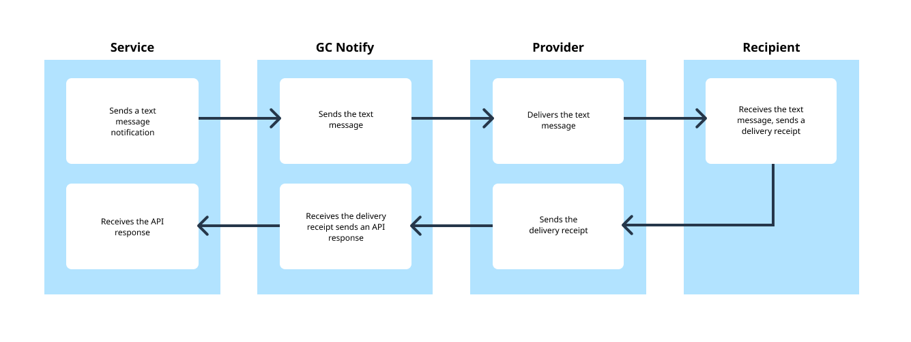
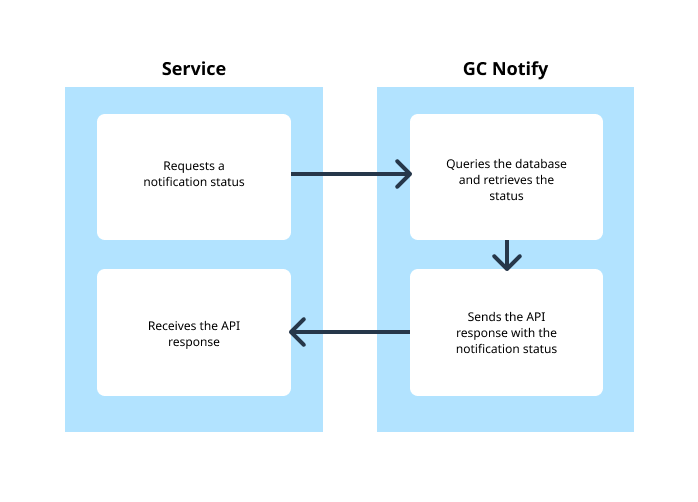

# API architecture

## Sending an email

1. The service sends an email notification to GC Notify.
1. GC Notify sends the email to the provider.
1. The provider delivers the email to the recipient.
1. The recipient receives the email and sends a delivery receipt to the provider.
1. The provider sends the delivery receipt to GC Notify.
1. GC Notify receives the delivery receipt and sends an API response to the service.
1. The service receives the API response.

## Sending a text message

1. The service sends a text message notification to GC Notify.
1. GC Notify sends the text message to the provider.
1. The provider delivers the text message to the recipient.
1. The recipient receives the text message and sends a delivery receipt to the provider.
1. The provider sends the delivery receipt to GC Notify.
1. GC Notify receives the delivery receipt and sends an API response to the service.
1. The service receives the API response.

## Getting the status of a message

1. The service requests a notification status from GC Notify.
1. GC Notify queries the database and retrieves the notification status.
1. GC Notify sends the API response with the notification status to the service.
1. The service receives the API response...
