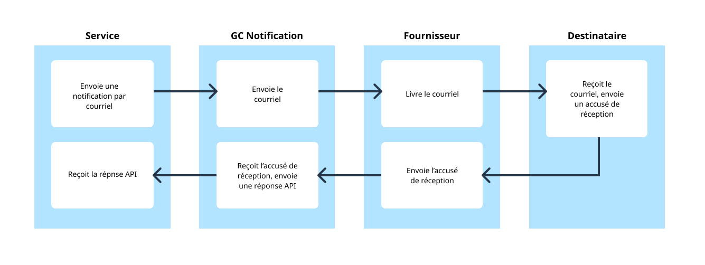
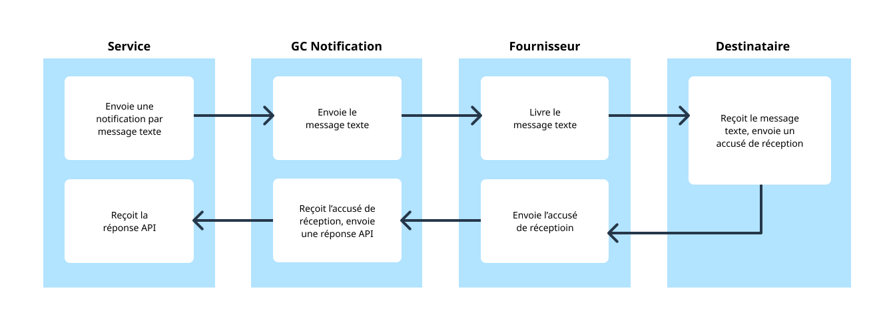
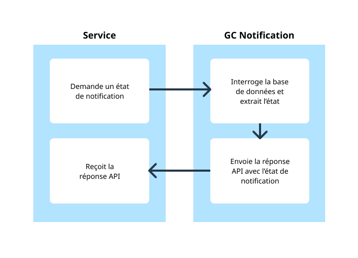

# Architecture API

## Envoyer un courriel

1. Le service envoie une notification par courriel à GC Notification.
1. GC Notification envoie le courriel au fournisseur.
1. Le fournisseur livre le courriel au destinataire.
1. Le destinataire reçoit le courriel et envoie un accusé de réception au fournisseur.
1. Le fournisseur envoie l’accusé de réception à GC Notification.
1. GC Notification reçoit l’accusé de réception et envoie une réponse API au service.
1. Le service reçoit la réponse API.

## Envoyer un message texte

1. Le service envoie une notification par message texte à GC Notification.
1. GC Notification envoie le message texte au fournisseur.
1. Le fournisseur livre le message texte au destinataire.
1. Le destinataire reçoit le message texte et envoie un accusé de réception au fournisseur.
1. Le fournisseur envoie l’accusé de réception à GC Notification.
1. GC Notification reçoit l’accusé de réception et envoie une réponse API au service.
1. Le service reçoit la réponse API.

## Obtenir l’état d’un message

1. Le service demande un état de notification à GC Notification.
1. GC Notification interroge la base de données et extrait l’état de notification.
1. GC Notification envoie la réponse API avec l’état de notification au service.
1. Le service reçoit la réponse API.
